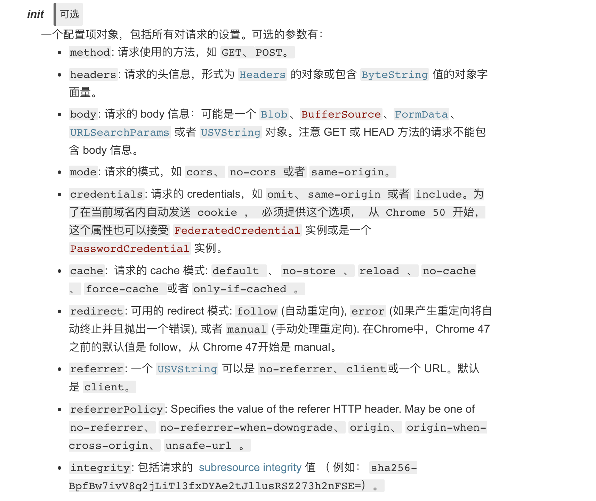
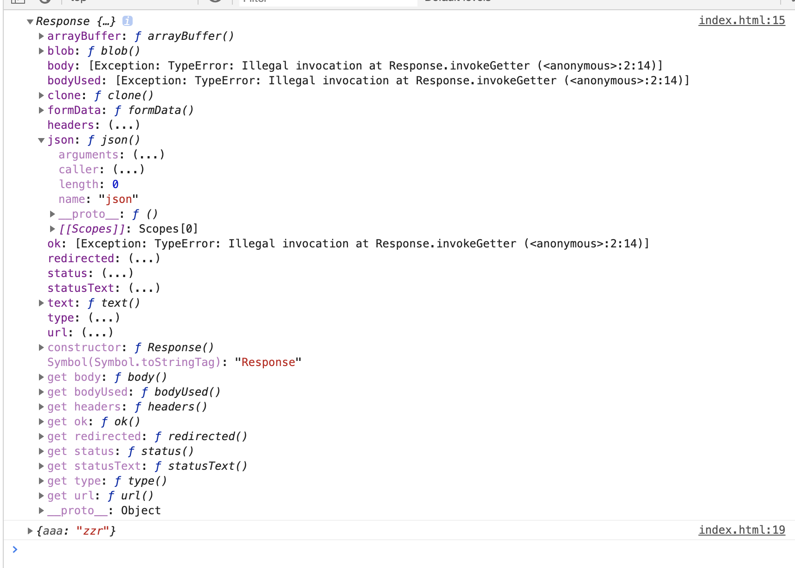

# FETCH

## what is fetch 

``` js
console.log(fetch)  
// ƒ fetch() { [native code] }
```

## 参数
 
第一个参数 必须

>定义要获取的资源。这可能是：
1、一个 USVString 字符串，包含要获取资源的 URL。一些浏览器会接受 blob: 和 data: 作为 schemes.
2、一个 Request 对象。

第二个参数 可选

请求的陪配置 一个 Object



## 请求一个json 文件

``` js
fetch('http://localhost:8888', {
    mode: 'cors',
    )
    .then(function(response) {
        console.log(response.__proto__)
        return response.json();
    })
    .then(function(myJson) {
        console.log(myJson);
    });
```
输出


服务端的 node 代码
``` js
var http = require("http");

http.createServer(function (request, response) {

    response.setHeader("Access-Control-Allow-Origin", "*"); 
    let json = {
        name: 'zzr'
    }
    response.end(JSON.stringify(json));
}).listen(8888);
```

## 定义自己的 require文件

``` js
let baseConfig = {
    method: 'POST',
    headers: new Headers({ "Content-Type": "text/plain" }),
    mode: 'cors',
    cache: 'default',
    body: {}
}
function getConfig(config) {
    let obj = Object.assign({}, baseConfig, config)
    if (obj.headers["Content-Type"] === 'application/json') {
        obj.body = JSON.stringify(obj.body)
    }
    return obj
}
unction myFetch (data) {
    return fetch(data.url, getConfig(data.config))
        .then(response => {
            if(response.status === 200) {
                return response
            } else {
                // 提示网络请求错误
                throw new Error('Network response was not ok.');
            }
        })
        .catch(error => console.error('Error:', error))
}
// 调用
myFetch({
    url: 'http://localhost:8888',
    config: {}
}).then(res => {
    console.log(res)
})
```