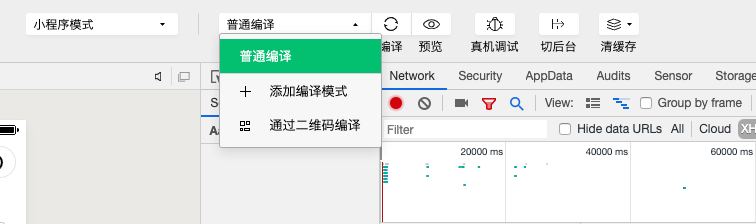

# taro 自学手记 

## taro 多端的区分

根据打包命令的参数进行区分,区分方式如下

``` js
if (process.env.TARO_ENV === 'h5') {
    // h5
} else if (process.env.TARO_ENV === 'weapp') {
    //  小程序
}
```
以下是 taro 的打包命令
```
    "scripts": {
    "build:weapp": "taro build --type weapp",
    "build:swan": "taro build --type swan",
    "build:alipay": "taro build --type alipay",
    "build:tt": "taro build --type tt",
    "build:h5": "taro build --type h5",
    "build:rn": "taro build --type rn",
    "dev:weapp": "npm run build:weapp -- --watch",
    "dev:swan": "npm run build:swan -- --watch",
    "dev:alipay": "npm run build:alipay -- --watch",
    "dev:tt": "npm run build:tt -- --watch",
    "dev:h5": "npm run build:h5 -- --watch",
    "dev:rn": "npm run build:rn -- --watch"
  },
```

## taro 使用 微信的 jssdk

taro支持npm包，所以就在taro中引用微信 jssdk 的包

> weixin-js-sdk

这里有两种使用方式 
1、在需要调用的页面引用；
2、在app.js中引用并注册到app中 在需要使用的页面引入app

``` js
if (process.env.TARO_ENV === 'h5') {
  var wx = require('weixin-js-sdk');
}
```

## taro 配置 history

[编译配置](http://taro-docs.jd.com/taro/docs/config-detail.html#h5router)

> publicPath 只能是 / 不可以是 ./ 

## setState 赋值之后 立即获取 state中的数据获取不到

```js
this.setState({
    name: 'zzr'
})
console.log(this.state.name) // 得到的值不是 zzr
```

解决方案

·1 利用 setState 第二个参数（回调函数做处理）

```js
this.setState({
    name, 'zzr'
}, () => {
    console.log(this,state.name)
})
```

·2 利用 es6 的 async await 

```js
async foo () {
    await this.setState({
        name: 'zzr'
    })
    console.log(this,state.name)
}
```

·3 利用 setTimeout

```js
this.setState({
    name: 'zzr'
})
setTimeout(() => {
    console.log(this,state.name)
})
```

## 获取地位置

1. 下载 [腾讯位置服务 小程序JS SDK](https://lbs.qq.com/product/miniapp/jssdk/)

2. 申请秘钥

3. 封装 getLocation.js 代码如下

``` js
var QQMapWX = require('./qqmap-wx-jssdk.min.js');
var qqmapsdk;
qqmapsdk = new QQMapWX({
  key: '' //这里自己的key秘钥进行填充
});

function getlocation (call) {
    wx.getSetting({
        success: (res) => {
          // res.authSetting['scope.userLocation'] == undefined    表示 初始化进入该页面
          // res.authSetting['scope.userLocation'] == false    表示 非初始化进入该页面,且未授权
          // res.authSetting['scope.userLocation'] == true    表示 地理位置授权
          if (res.authSetting['scope.userLocation'] != undefined && res.authSetting['scope.userLocation'] != true) {
            wx.showModal({
              title: '请求授权当前位置',
              content: '需要获取您的地理位置，请确认授权',
              success: function (res) {
                if (res.cancel) {
                  wx.showToast({
                    title: '拒绝授权',
                    icon: 'none',
                    duration: 1000
                  })
                } else if (res.confirm) {
                  wx.openSetting({
                    success: function (dataAu) {
                      if (dataAu.authSetting["scope.userLocation"] == true) {
                        wx.showToast({
                          title: '授权成功',
                          icon: 'success',
                          duration: 1000
                        })
                        //再次授权，调用wx.getLocation的API
                        
                      } else {
                        wx.showToast({
                          title: '授权失败',
                          icon: 'none',
                          duration: 1000
                        })
                      }
                    }
                  })
                }
              }
            })
          } else if (res.authSetting['scope.userLocation'] == undefined) {
            //调用wx.getLocation的API
            getLocation(call);
          }
          else {
            //调用wx.getLocation的API
            getLocation(call);
          }
        }
    })
}
function getLocation (call) {
    wx.getLocation({
      type: 'wgs84',
      success: function (res) {
        var latitude = res.latitude
        var longitude = res.longitude
        var speed = res.speed
        var accuracy = res.accuracy;
        getLocal(latitude, longitude,call)
      },
      fail: function (res) {
        // console.log('fail' + JSON.stringify(res))
      }
    })
}
 function getLocal(latitude, longitude,call) {
  let vm = this;
  qqmapsdk.reverseGeocoder({
    location: {
      latitude: latitude,
      longitude: longitude
    },
    success: function (res) {
      let province = res.result.ad_info.province
      let city = res.result.ad_info.city
     
      call && call(province)
    },
    fail: function (res) {
    },
    complete: function (res) {
    }
  });
}

export default getlocation;
```

4. 调用 

``` js
getlocation (res => {
    console.log(res)
})
```

## 小程序 canvas 尺寸兼容问题

> 小程序的单位是 rpx 已经做好了适配 但是canvas 是给定的 px 这里不能进行自动的适配所以就想到了如下的方案

公式：

1. 计算canvas宽

::: tip
画布宽 = windowWidth * 画布设计稿宽 / 设计稿满屏宽
:::

2. 元素宽计算

::: tip
元素所求宽 = 元素设计稿宽度 / 设计稿总宽 * 第一步所求出画布宽
:::

3. 计算出设计稿1px宽度代表的实际值

::: tip
baseWidth = 元素所求宽 / 元素设计稿的宽度
:::

4. 计算需要使用的宽度和高度(宽度和高度统一使用宽度进行计算)

``` js
function getWidth (width) {
  return baseWidth * width
}
function getHeight (height) {
  return baseWidth * height
}
```

## 小程序实现 s 标签效果

``` css
text-decoration:line-through;
```

## taro canvasToTempFilePath 方法 放在组件内部 也会报错 canvasId do not exist

::: tip
canvas 的标签不放在组件内部进行封装
:::

## taro 小程序发布提示用户更新

``` js
// 在app.js里写下以下代码
  onLaunch () {
    if (wx.canIUse('getUpdateManager')) {
      const updateManager = wx.getUpdateManager()
      updateManager.onCheckForUpdate(function (res) {
        if (res.hasUpdate) {
          updateManager.onUpdateReady(function () {
            wx.showModal({
              title: '更新提示',
              content: '新版本已经准备好，是否重启应用？',
              success: function (res) {
                if (res.confirm) {
                  updateManager.applyUpdate()
                }
              }
            })
          })
          updateManager.onUpdateFailed(function () {
            wx.showModal({
              title: '已经有新版本了哟~',
              content: '新版本已经上线啦~，请您删除当前小程序，重新搜索打开哟~'
            })
          })
        }
      })t
    }
  }
```

## 开发环境调试 识别二维码



选择 生成好了的小程序二维码

## taro 获取小程序分享的scene

> this.$router.params.scene

一般用 & = 方式拼接 scene参数

这里放一个解析参数的函数

``` js
getScene () {
  let str = this.$router.params.scene
  if (str) {
    let arr = decodeURIComponent(str).split('&')
    let obj = {}
    arr.forEach(v => {
      let array = v.split('=')
      obj[array[0]] = array[1]
    })
    return obj
  }
}
```

## taro 设置单个页面的顶部背景色 和 文字颜色

``` js
config = {
  navigationBarTitleText: '个人中心',
  navigationBarBackgroundColor: '#FF3C00',
  navigationBarTextStyle: 'white'
}
```

## 小程序登录流程梳理

微信改版过后 获取用户信息和手机号必须引导用户点击button的方式得到

获取用户信息

``` html
<button open-type ='getUserInfo' bindgetuserinfo="getUserInfo"></button>
```
``` js
getUserInfo (e) {
  console.log(e)
}
```

获取用户手机号

``` html
<button open-type ='getPhoneNumber' bindgetphonenumber="getPhoneNumber"></button>
```
``` js
getPhoneNumber (e) {
  console.log(e)
}
```

用户自动登录流程

小程序提供 wx.loing() 方法 这个方法只有 通过按钮引导用户授权之后 才可以成功的调用

判断用户是否 授权

``` js
Taro.getSetting({
    success: res => {
      if (!res.authSetting['scope.userInfo']) {
       //未授权
      } else {
        // 授权
      }
    }
  })
```

未授权引导用户授权 拿到 加密字符串 解密拿到 openid  unionid 等信息

已经授权的 通过 wx.login() 获取到code  通过code 获得 用信息 解密拿到 openid  unionid 等信息

## taro ui 阻止冒泡问题

> taro ui 的标签 不支持 阻止冒泡处理  需要用原声的标签包裹一层

## 开箱可用的保存图片功能

``` js 
function loadImg (src) {
  wx.getSetting({
    success: (res) => {
      // 如果没有则获取授权
      console.log(res, src)
      if (!res.authSetting['scope.writePhotosAlbum']) {
        wx.authorize({
          scope: 'scope.writePhotosAlbum',
          success: () => {
            wx.saveImageToPhotosAlbum({
              filePath: src,
              success() {
                wx.showToast({
                  title: '保存成功'
                })
              },
              fail() {
                wx.showToast({
                  title: '保存失败',
                  icon: 'none'
                })
              }
            })
          }
        })
      } else {
        // 有则直接保存
        wx.saveImageToPhotosAlbum({
          filePath: src,
          success() {
            wx.showToast({
              title: '保存成功'
            })
          },
          fail() {
            wx.showToast({
              title: '保存失败',
              icon: 'none'
            })
          }
        })
      }
    }
  })
}
```

## taro 组件调用

1、组件名必须首字母大写，否则在组件中 props 字段会一直是一个空对象
2、参数校验

``` js
{组件定义模版名称}.propTypes = {
    show: PropTypes.bool.isRequired,
    onHandleToggleShow: PropTypes.func.isRequired,
}
```

3、子组件调用父组件的方法必须以 on 开头

## Taro 引用 阿拉丁小程序

在 app 引用 ald-start 报错 栈溢出了

解决方案 在每一个 模版中单独引用

## canvas生成海报 在有些安卓机上出现黑背景

::: tip
解决方案： 在黑背景的地方 手动画一下 #fff的背景色就可以解决
:::

## 兼容问题 
最近一次微信更新
multiSelector 类型的 piker 第一次唤起改变某一列之后onColumnChange 不生效 点击确定之后才会生效

问题原因：没有给默认的value值

解决办法： value 赋值（Array）初始数据

## Image 之间的 间距问题

1. 给Image的父元素设置font-size: 0;

2. 给 Image 设置 float: left; 父元素 overflow: hidden;

3. 设置图片的垂直对齐方式

``` css
  .my-img {
    vertical-align: top;
    vertical-align: text-top;
    vertical-align: bottom;
    vertical-align: text-bottom;
  }
```

4. 父元素设置 display: flse; flex-direction: column;

5. 如果还有问题给 Image 设置 margin-top: -1px;