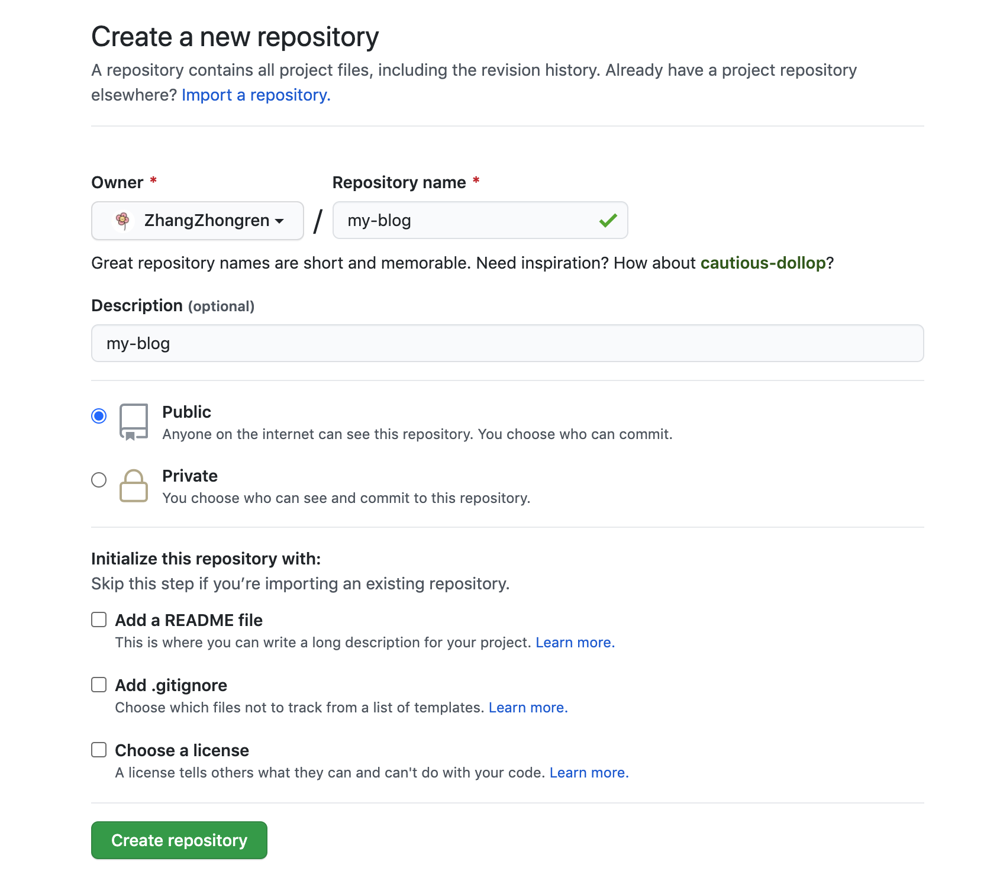

1. github 上新建一个仓库 my-blog



2. clone 到本地

> git clone https://github.com/{uaername}/my-blog.git

其中 uaername 是你github的用户名

3. 创建一个 存放代码的分支 并切换分支

  > git branch code

  > git checkout code


4. 根据 vuepress 创建一个项目

[vuePress](https://www.vuepress.cn/)

5. 创建自动化发布脚本
 
  1. 在根目录创建 .github 文件夹
    
    > mkdir .github && cd .github

  2. 在 .github 文件夹下创建 workflow 文件

    > mkdir workflow && cd workflow
  
  3. 在 workflow 下创建 action.yaml 文件
    
    > touch action.yaml
  
  4. 将下内容填充到文件内

  ``` yaml
    name: GitHub Actions Build and Deploy Demo
    on:
      push:
        branches:
          - code
        pull_request:
        # The branches below must be a subset of the branches above
          branches: code
    jobs:
      build-and-deploy:
        runs-on: ubuntu-latest
        steps:
        - name: Checkout repository
          uses: actions/checkout@v2
          with:
            fetch-depth: 2
        - run: git checkout code
          if: ${{ github.event_name == 'pull_request' }}

        - name: Install and Build
          run: |
            npm install
            npm run build

        - name: Deploy
          uses: JamesIves/github-pages-deploy-action@3.7.1
          with:
            ACCESS_TOKEN: ${{ secrets.ACCESS_TOKEN }} 
            # secrets.ACCESS_TOKEN 套替换成自己的
            BRANCH: master
            FOLDER: docs/.vuepress/dist
  ```
  5. 在GitHub上 创建 Secrets 并填入 action.yaml 的 ACCESS_TOKEN

6. 将本地代码推送到远程仓库
 